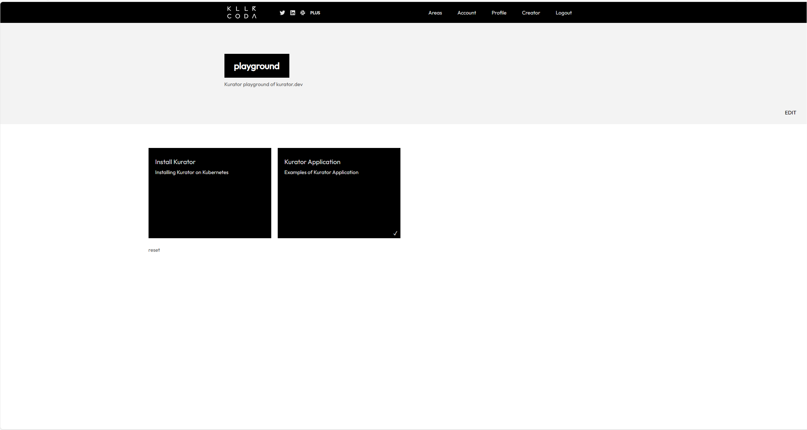

## Kurator Playground Scenarios

Kurator is an open source distributed cloud native platform that helps users to build their own distributed cloud native infrastructure and facilitates enterprise digital transformation.

Kurator stands on shoulders of many popular cloud native software stacks including
[Kubernetes](https://github.com/kubernetes/kubernetes), [Istio](https://github.com/istio/istio), [Prometheus](https://github.com/prometheus/prometheus), [FluxCD](https://github.com/fluxcd/flux2), [KubeEdge](https://github.com/kubeedge/kubeedge), [Volcano](https://github.com/volcano-sh/volcano), [Karmada](https://github.com/karmada-io/karmada), [Kyverno](https://github.com/kyverno/kyverno), etc.
It provides powerful capabilities for multi-cloud and multi-cluster management, including:

- Multi-cloud, Edge-cloud, Edge-edge Synergy
- Unified Resource Orchestration
- Unified Scheduling
- Unified Traffic Management
- Unified Telemetry
  
## Available platforms

You can enjoy tutorial experience about Karmada with following platforms.

- Try [Installing Kurator on Kubernetes](https://killercoda.com/965010e0-4f60-4a28-bf27-597d3kurator/scenario/install-kurator).
- Try [Distribute deployments using the kurator Application feature](https://killercoda.com/965010e0-4f60-4a28-bf27-597d3kurator/scenario/application-example).

## Contribution

Please refer to [kurator Contributing](https://github.com/kurator-dev/kurator/blob/main/CONTRIBUTING.md)

If you know of any excellent online interactive platforms, we welcome any pull requests to adapt the scenarios to the new platform.
