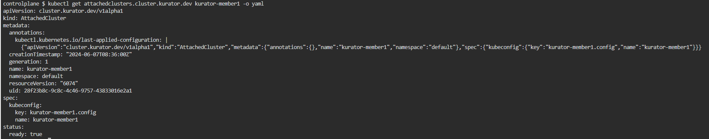

## Prerequisites

### AttachedCluster secrets 

RUN `kubectl create secret generic kurator-member1 --from-file=kurator-member1.config=/root/.kube/config-member1`{{exec}}

RUN `kubectl create secret generic kurator-member2 --from-file=kurator-member2.config=/root/.kube/config-member2`{{exec}}

### Create attachedCluster resources

Now that we have the prerequisites sorted out, let’s move on to creating the AttachedCluster resources.

We’ll start by editing the configuration for the AttachedCluster.

Notice that the name and key here need to be consistent with the secret generated earlier.

We can apply the resources using the configuration provided below.

```console
apiVersion: cluster.kurator.dev/v1alpha1
kind: AttachedCluster
metadata:
  name: kurator-member1
  namespace: default
spec:
  kubeconfig:
    name: kurator-member1
    key: kurator-member1.config
---
apiVersion: cluster.kurator.dev/v1alpha1
kind: AttachedCluster
metadata:
  name: kurator-member2
  namespace: default
spec:
  kubeconfig:
    name: kurator-member2
    key: kurator-member2.config
```

RUN `kubectl apply -f attachcluster.yaml`{{exec}}

### View resource status

RUN `kubectl get attachedclusters.cluster.kurator.dev kurator-member1 -o yaml`{{exec}}

If the ready in status is true, the attachcluster was added successfully.


