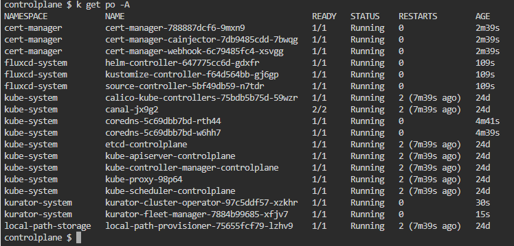

### Install Kurator

- Update Helm Repo

RUN `helm repo add kurator https://kurator-dev.github.io/helm-charts && helm repo update`{{exec}}

- Install `cluster-operator` and `fleet-manager`

RUN `helm install --create-namespace  kurator-cluster-operator kurator/cluster-operator --version=0.6.0 -n kurator-system`{{exec}}

RUN `helm install --create-namespace  kurator-fleet-manager kurator/fleet-manager --version=0.6.0 -n kurator-system`{{exec}}

- Check kurator Resource

RUN `kubectl get pod -A`{{exec}}

The following example is output, indicating that the addition was successful

